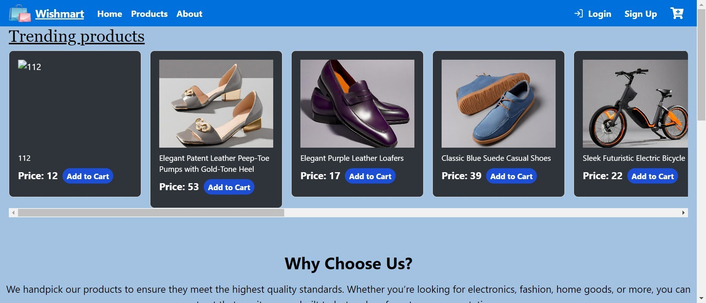
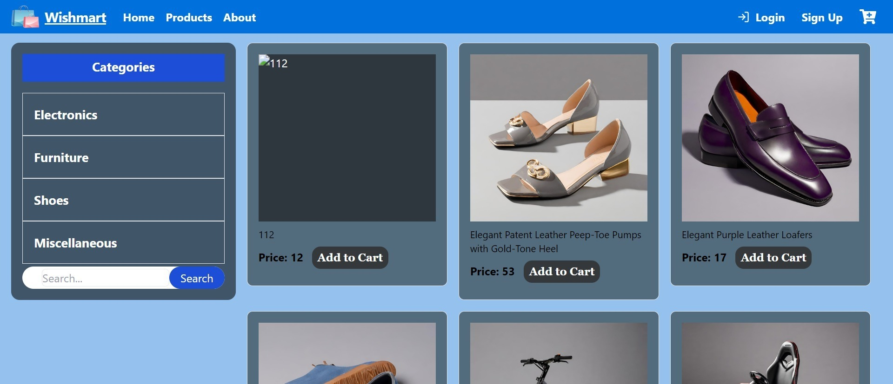
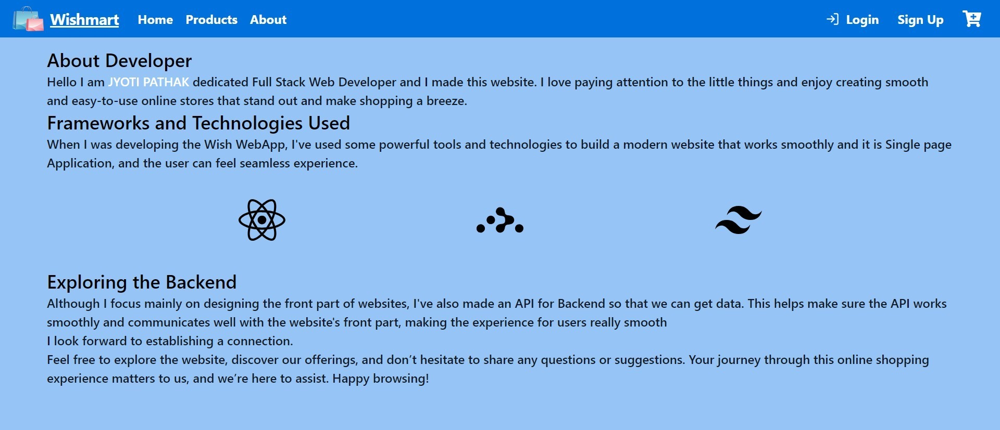
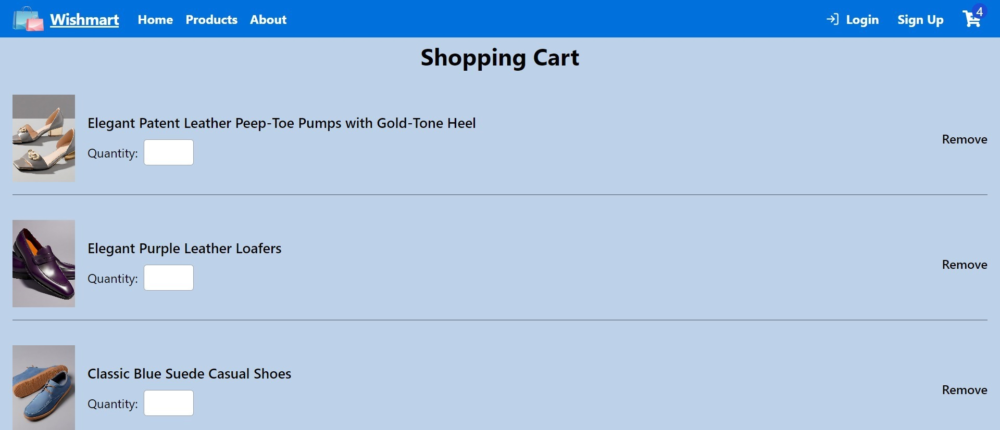
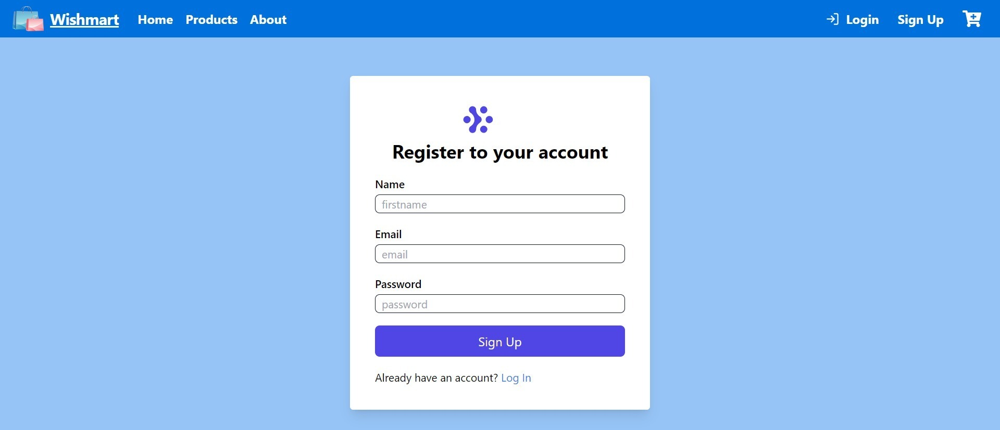
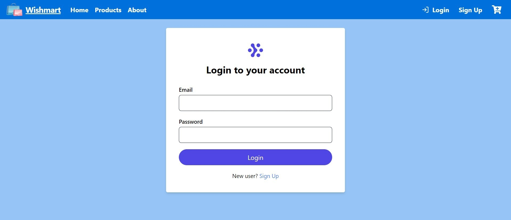
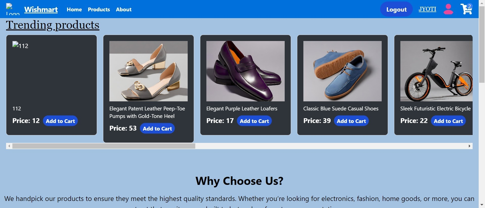
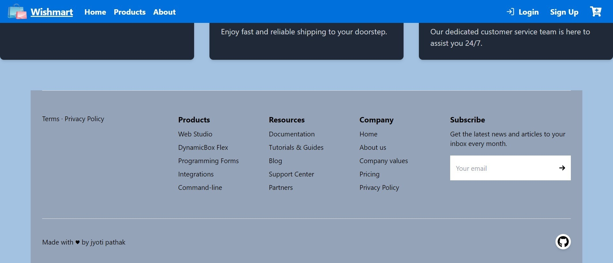

## 💫`Wish webApp`
  Wish WebApp is an e-commerce platform where users can browse, select, and purchase products to fulfill their wishes. The website offers a seamless and responsive shopping experience, allowing users to easily navigate through different product categories and manage their shopping cart. To make a purchase, users must sign up and log in to the platform.

## Features:

Category Selection: Users can browse products by category, such as furniture, and add multiple items to their cart.
Responsive Design: The website provides a seamless experience across various devices.
Cart Management: Users can view and manage the items in their cart before making a purchase.

## Main pages of the project

# Home page


# products


# About


# Cart


# signup

# Login


# After Login


# Footer



##  🌿 `Project Folder Structure`
1. [src/app.js]  in this page all the components are imported and applied Routes
2.[src/index.js]  for managing the whole the website.
3. [src/components]  in this file all the dependency are their .
4. [src/ui] here the ui of about ,searchbar,footer are availbale.
5. [src/Redux] redux file are available here
6. [src/utils] services of API  is available here.


## 🌐 `Languages and Tools used`
  - React:-Javasript library which used to make Ui.
  - Redux:-Redux is state management tool for manage state.
  - React-Router:- for Routing go to different pages
  - Tailwind Css:- Utility Css frameWork which used for styling the webapge of the wishWebApp and make responsive Project.
  - React icons: we use react-icons because for icons.
  -Authentication : json local server  


## 🔧 `Project Clonning and Running`
- To run this project locally, use the following command in your CLI:
- 1. Clone this repository:

```bash
  https://github.com/jyotipatthak/wishmart
```

2. Install dependencies:

```bash
 npm i
```

3. Start the application:

```bash
 npm run start
```
- Go to any Browser and search localhost:3000

## ✨`Deployment`

**Link of gitgub page** : https://github.com/jyotipatthak/wishmart

**Link to wish web app video**: https://youtu.be/12DpNd5jJXo?si=EpFyYPLAUBAc8Dd3

**Web Deployed Link**:  https://wishmart.vercel.app/

## API

**Api which i used** :https://docs.google.com/document/d/19iEA9YereVxkWHDOKZ4iJgl9-8_el6cAFk3tVEKaMqk/edit?usp=sharing

## 🎋 `COLLABORATORS`
This project is created within a team of two members.
- [@MD Shahnawaz](https://github.com/Shahnawaz1967)
- [@jyoti pathak](https://github.com/jyotipatthak)]

##  📚`Feedback`

If you have any feedback, please reach out to us at ashahnawaz010@gmail.com /jyotipathak604@gmail.com

